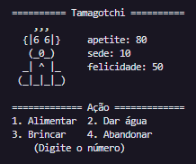

# Tamagotchi

  

    
    

      O Tamagotchi é um projeto em C# que simula um animal de estimação virtual, onde você pode interagir com ele alimentando-o, dando água, brincando e verificando sua saúde.
    

         
  

## Funcionalidades
- Alimentar o Tamagotchi
- Dar água ao Tamagotchi
- Brincar com o Tamagotchi
- Verificar o estado do Tamagotchi
- Sair do jogo

## Como Executar
1. Certifique-se de ter o ambiente de desenvolvimento C# instalado em sua máquina.
2. Clone este repositório em sua máquina local.
3. Abra o projeto em seu ambiente de desenvolvimento.
4. Compile e execute o programa.
